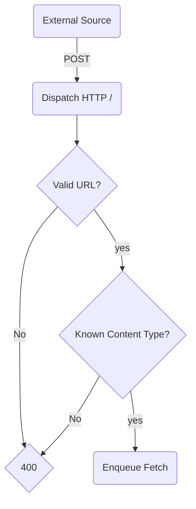

# Dispatch

Responsible for ingesting URLs that are to be archived.

The main export of the Dispatch package is the `dispatchApp`, which handles
incoming POST requests. Incoming POST requests are expected to have a body
containing a single line of just the URL to be parsed. The `dispatchApp` then
runs the URL through a series of parsers to determine if it is a known-good
URL that can be archived. If so, the URL is sent off to a queue where other
services responsible for fetching the URL can receive it.
